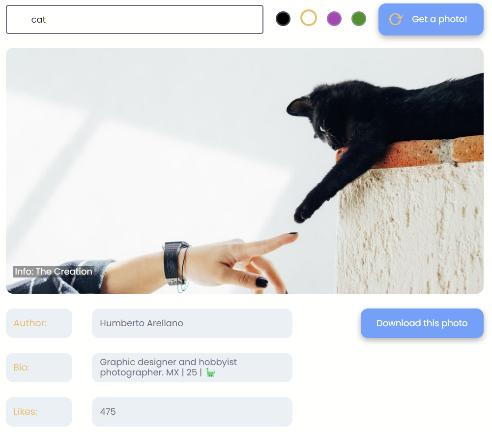

# Photo generator

### Brief description

---

- responsive markup (desktop + mobile);
- photo can be fetched from Unsplash by clicking the upper button (Unsplash API);
- user can choose a query and prevailing color;
- grid containers below get information about a received photo from the server;
- high-resolution photos can be downloaded by clicking a download button

### **Check it out!**

---

- [Link to **GitHub Pages**](https://julbrn.github.io/randomImage/)

